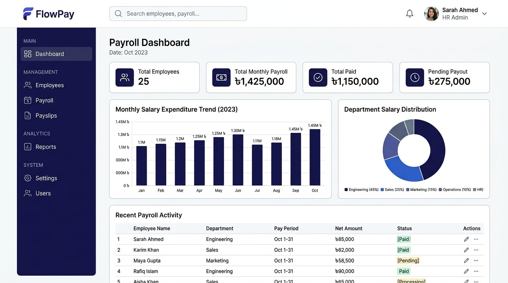

# 💼 FlowPay — Enterprise Salary & Payroll Management System

<p align="center">
  
</p>

<p align="center">
  A modern, high-performance, enterprise-grade company <strong>Salary & Payroll Management Web Application</strong> built for HR teams, accountants, managers, and business owners.
</p>

<p align="center">
  
  
  
  
  
  
</p>

---

## 📸 Dashboard Preview



---

## 🌟 Key Modules & Capabilities

### 1. 📊 Financial Overview Dashboard
- **KPI Metrics**: Real-time tracking of Total Employees, Total Monthly Payroll, Disbursed Salary, and Pending Payouts.
- **Visual Analytics**: Interactive salary expenditure trends (monthly bar/line charts) and department-wise cost distribution.
- **Paid vs. Pending Visualization**: Quick glance at payout completion rates.
- **Audit Activity Feed**: Timestamped stream of recent approvals, drafts, and disbursements.
- **Period Filter**: Filter metrics across any month and year.

### 2. 👥 Employee Management
- **Employee Directory**: Searchable, filterable, and paginated table with department and status filters.
- **Full Employee Profiles**: Complete records including Employee ID, designation, joining date, contact details, bank/routing information, and employment status.
- **Salary Structure**: Fine-grained tracking of Basic Salary, Allowances, Bonuses, Overtime, Deductions, and Tax withholdings.
- **Department Setup**: Dedicated department management with cost allocation.

### 3. 💳 Payroll Management & Processing
- **Automated Calculation Engine**:
  $$\text{Gross Salary} = \text{Basic} + \text{Allowances} + \text{Bonus} + \text{Overtime}$$
  $$\text{Total Deductions} = \text{Deductions} + \text{Tax}$$
  $$\text{Net Salary} = \text{Gross Salary} - \text{Total Deductions}$$
- **Negative Salary Safeguard**: Strict calculation validation preventing negative net salaries.
- **Batch Processing**: One-click batch approval and disbursement for selected departments or employees.
- **Status Workflow**: Clear transitions from `Draft` $\rightarrow$ `Approved` $\rightarrow$ `Paid`.
- **Payroll History**: Searchable archive of all historical payroll runs with granular detail views.

### 4. 📄 Interactive Payslips & PDF Generation
- **Branded Templates**: Clean, professional printable payslips with company header, employee details, earnings, and deductions.
- **Client-Side PDF Export**: High-fidelity PDF generation via `jsPDF` and `html2canvas` for download or print.
- **Employee Self-Service**: Employees can securely access and download their historical payslips.

### 5. 📈 Financial & Tax Reports
- **Salary Report**: Detailed breakdowns of gross, net, deductions, and tax withholdings.
- **Department Cost Center**: Expense distribution and headcount analysis by organizational unit.
- **Payment Reconciliation**: Breakdown across Bank Transfer, Mobile Banking, Cash, and Checks.
- **Yearly Summary**: Quarterly aggregations and year-over-year expenditure patterns.
- **Export Formats**: One-click exports to **Excel (`.xlsx`)** and **CSV**.

### 6. 🔐 Role-Based Access Control (RBAC) & Security
- **Multi-Role Support**: Tailored interfaces and permissions for `Owner`, `Admin`, `Accountant`, `HR`, and `Employee`.
- **1-Click Demo Login**: Switch roles instantly from the login screen for testing and evaluation.
- **Data Persistence**: Robust client-side state persistence via `localStorage` with seed data pre-loaded (~25 employees, 6 months historical payroll).

---

## 👥 Demo Accounts (Role-Based Access)

FlowPay comes pre-seeded with 5 accounts accessible with **1-click buttons** on the login screen or via credentials:

| Role | Email / Shortcut | Password | Key Permissions |
| :--- | :--- | :--- | :--- |
| **Owner** | `owner@payscale.com` (or `owner`) | `password123` | Full system access, company settings, and user administration |
| **Admin** | `admin@payscale.com` (or `admin`) | `password123` | Payroll generation, employee management, reports, and approvals |
| **Accountant** | `accountant@payscale.com` (or `accountant`) | `password123` | Payment disbursements, tax reports, and salary reconciliations |
| **HR** | `hr@payscale.com` (or `hr`) | `password123` | Employee lifecycle, allowances, departments, and payslips |
| **Employee** | `employee@payscale.com` (or `employee`) | `password123` | Personal profile and individual payslip downloads |

---

## 🛠️ Tech Stack & Architecture

- **Framework**: [React 18](https://react.dev/) + [Vite](https://vitejs.dev/)
- **Language**: [TypeScript](https://www.typescriptlang.org/) (Strict typing with 0 compiler errors)
- **Styling**: [Tailwind CSS](https://tailwindcss.com/) with enterprise neutral/indigo theme
- **UI Primitives**: [Radix UI](https://www.radix-ui.com/) + [shadcn/ui](https://ui.shadcn.com/)
- **Icons**: [Lucide React](https://lucide.dev/)
- **Charts**: [Recharts](https://recharts.org/)
- **Forms & Validation**: [React Hook Form](https://react-hook-form.com/) + [Zod](https://zod.dev/)
- **State Management**: [Zustand](https://github.com/pmndrs/zustand) with persistence middleware
- **Reporting & Export**: [XLSX](https://github.com/SheetJS/sheetjs), [jsPDF](https://github.com/parallax/jsPDF), and [html2canvas](https://html2canvas.hertzen.com/)
- **Notifications**: [Sonner](https://sonner.emilkowal.ski/)

---

## 📁 Project Structure

```text
├── public/                # Static assets and icons
├── docs/                  # Documentation assets & screenshots
│   └── dashboard.png      # Application preview image
├── src/
│   ├── components/
│   │   ├── auth/          # Authentication & Route Guards
│   │   ├── layout/        # Sidebar, Header, and MainLayout
│   │   ├── payslip/       # Printable Payslip template & preview modal
│   │   ├── shared/        # StatCard, PageHeader, DataTable, CurrencyDisplay
│   │   └── ui/            # shadcn/ui Radix component primitives
│   ├── hooks/             # Custom hooks (permissions, export handlers)
│   ├── lib/
│   │   ├── constants.ts   # Roles, departments, payment methods, permissions
│   │   ├── export.ts      # Excel, CSV, and PDF export engines
│   │   ├── salary.ts      # Pure salary math & validation routines
│   │   ├── seedData.ts    # 25 pre-loaded employees & 6-month payroll data
│   │   ├── types.ts       # Central TypeScript interfaces and contracts
│   │   └── utils.ts       # Formatting, ID generation, and class mergers
│   ├── pages/
│   │   ├── auth/          # Login Page with 1-click credentials
│   │   ├── dashboard/     # Executive Financial Overview
│   │   ├── employees/     # Employee directory, add form, profiles, departments
│   │   ├── payroll/       # Current payroll, generation wizard, history, detail
│   │   ├── payslips/      # Payslip list and preview
│   │   ├── reports/       # Salary, department, payment, and yearly reports
│   │   └── settings/      # Company, salary rules, and user management
│   ├── stores/            # Zustand stores (auth, employee, payroll, settings)
│   ├── App.tsx            # Application routing and providers
│   └── main.tsx           # React DOM root entrypoint
├── package.json           # Dependencies and build scripts
└── vite.config.ts         # Vite configuration
```

---

## 🚀 Getting Started

### Prerequisites
- [Node.js](https://nodejs.org/) (v18.0.0 or higher recommended)
- `npm` or `pnpm` or `yarn`

### Installation

1. **Clone the repository**:
   ```bash
   git clone https://github.com/Eftyqhar/FlowPay.git
   cd FlowPay
   ```

2. **Install dependencies**:
   ```bash
   npm install
   ```

3. **Start the development server**:
   ```bash
   npm run dev
   ```

4. **Open in browser**:
   Navigate to [http://localhost:5173/](http://localhost:5173/) to access the application.

### Production Build

To build the application for production:
```bash
npm run build
```

To preview the production build locally:
```bash
npm run preview
```

---

## 📜 License

This project is licensed under the MIT License — see the [LICENSE](LICENSE) file for details.
